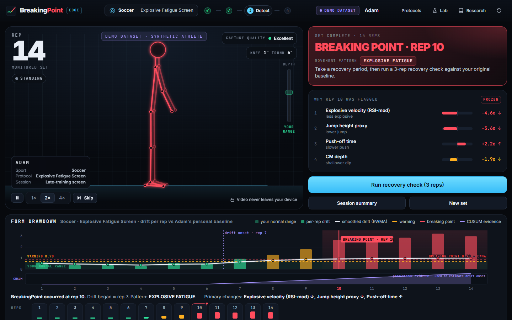
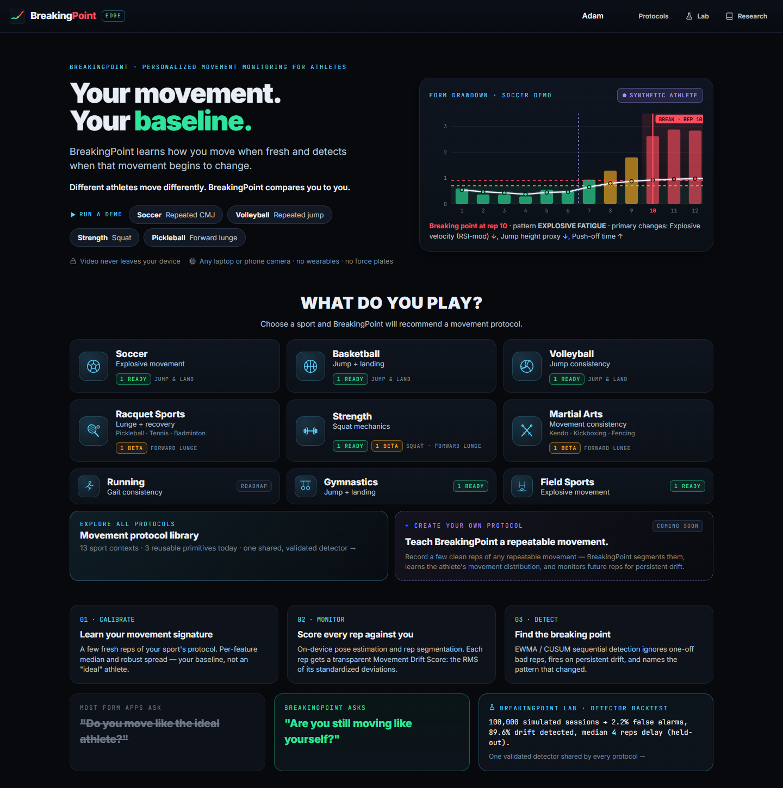
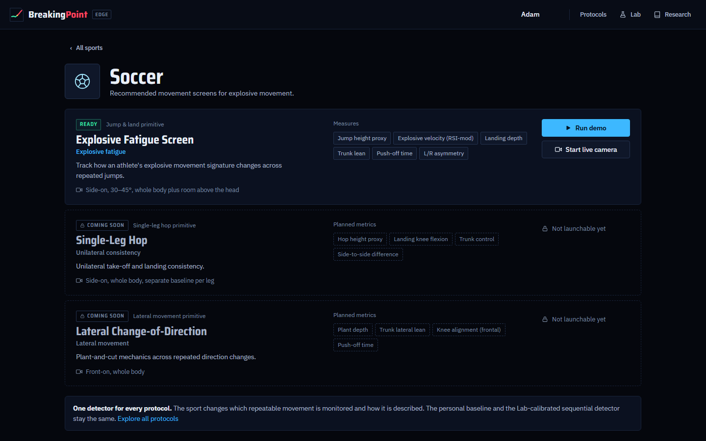
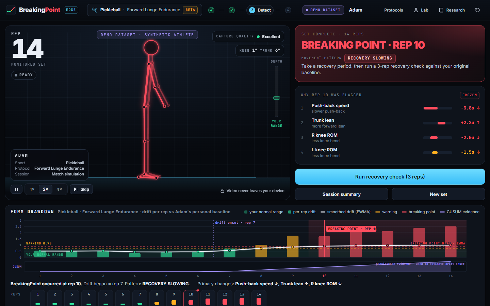
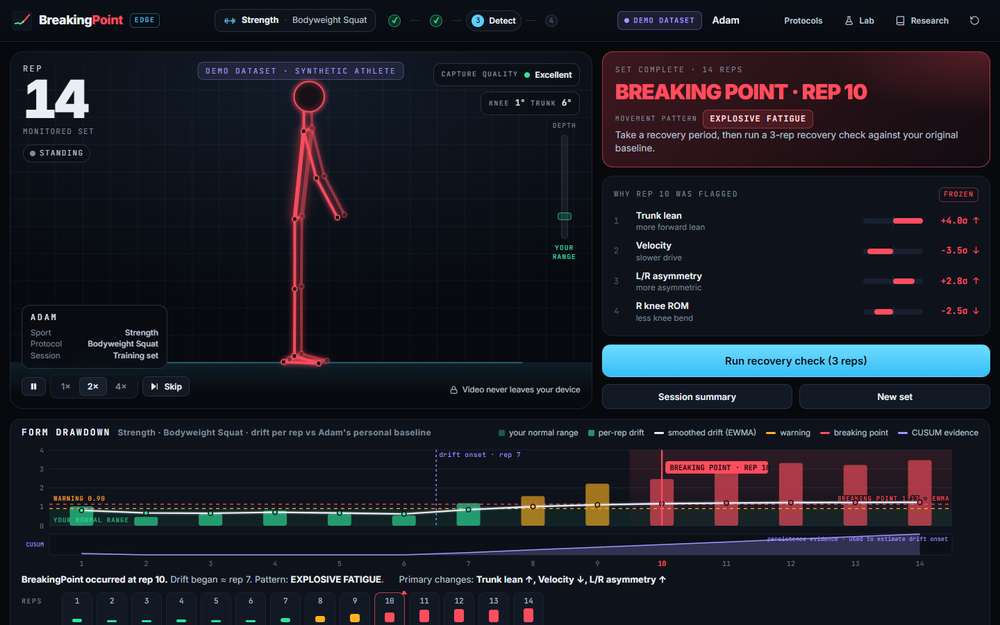
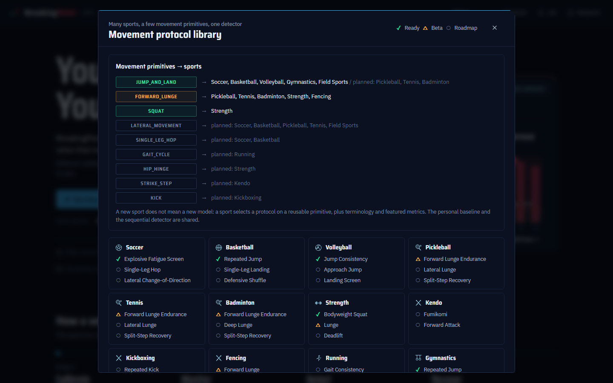
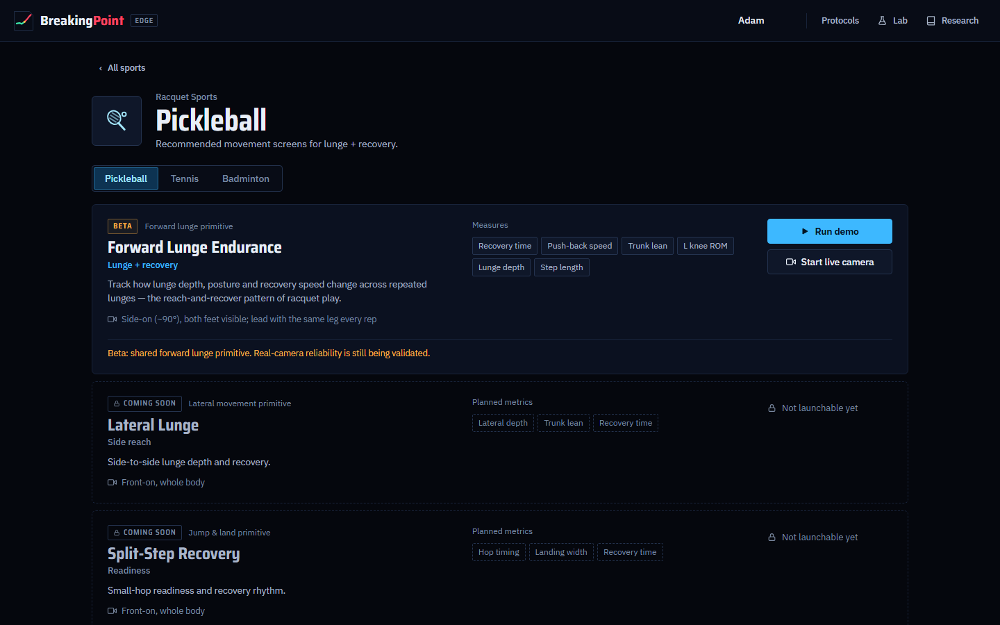
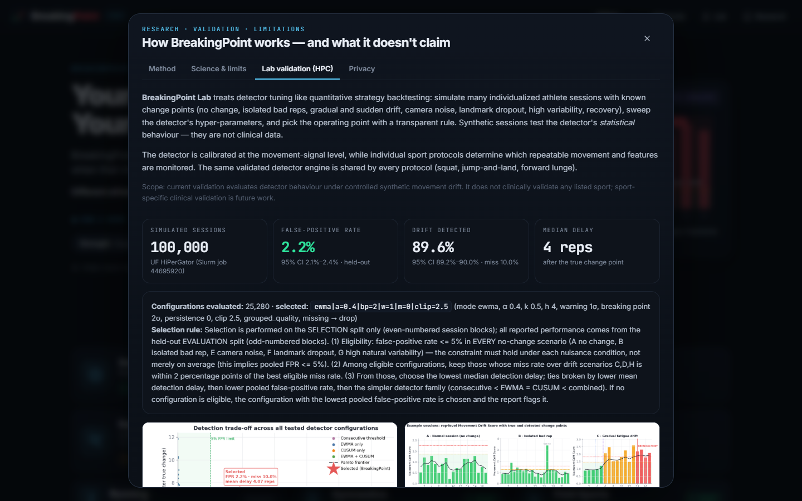
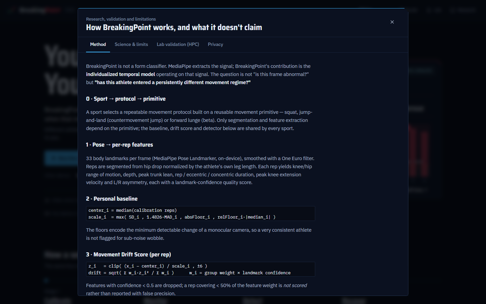
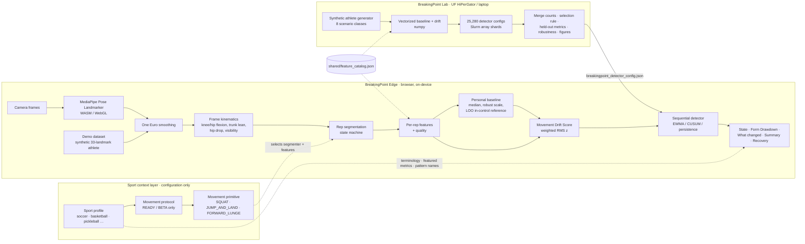

<div align="center">


# BreakingPoint

### Detect the rep where fatigue starts changing how you move and POINTS where you BREAK!

**Your movement. Your baseline.** Personalized movement monitoring for athletes.

**BreakingPoint uses ordinary camera video to learn an athlete's personal movement baseline and applies
sequential change-point detection to identify the moment fatigue begins causing persistent biomechanical drift —
across sports, through reusable movement protocols.**

`computer vision` · `biomechanics` · `sequential anomaly detection` · `personalized baselines` · `sport → protocol → primitive` · `HPC-validated detector`

<!-- Demo GIF placeholder: record the demo with `?demo=soccer&speed=2` and save as docs/demo.gif -->


> *BreakingPoint doesn't ask whether you move like the ideal athlete. It asks whether you still move like yourself.*

</div>

---

## The problem

Fatigue doesn't make an athlete forget how to squat. Their mechanics **drift**: a little less depth,
a little more trunk lean, a slower drive, a growing left/right difference. Each rep still "counts", so
the change is easy to miss until form has already broken down.

Most form apps compare you against universal rules ("knee angle should be X"). But athletes move
differently from one another, and an athlete can be perfectly consistent with *their own* technique
while differing from any "ideal". Lab tools (motion capture, force plates) can see within-athlete
change, but they are expensive and inaccessible.

## The idea

> We don't ask *"Does this look like the perfect squat?"*
> We ask **"Does this still look like YOUR squat?"**

BreakingPoint treats an athlete's movement like a monitored system in quantitative finance:

1. **Learn the regime** — a personalized baseline from 5–8 fresh reps.
2. **Score every rep** — a transparent Movement Drift Score (RMS of standardized deviations from *your* baseline).
3. **Detect the regime change** — EWMA / CUSUM sequential detection ignores a single bad rep and fires when drift **persists**.
4. **Explain it** — the features that moved most, in σ units: *trunk lean +2.4σ ↑, velocity −2.1σ ↓ …*
5. **Close the loop** — after rest, a 3-rep recovery check reports how far movement has returned toward baseline.

It runs entirely in the browser on any laptop or phone camera. **Video never leaves the device.**

## A movement-monitoring platform, not a squat app

Athletes choose a **sport**, BreakingPoint recommends a repeatable **movement protocol**, and the protocol runs on a
reusable **movement primitive**. A new sport does not mean a new model: sports only choose which movement is monitored,
which metrics are featured, and what the UI calls things. The personal baseline, drift score and sequential detector
are shared, with the same validated parameters for every protocol.

```
             BREAKINGPOINT
                   |
            SPORT PROFILE            soccer · basketball · volleyball · pickleball · tennis · badminton · strength · fencing …
                   |
          MOVEMENT PROTOCOL          Explosive Fatigue Screen · Jump Consistency · Forward Lunge Endurance · Bodyweight Squat …
                   |
             POSE SIGNAL             on-device MediaPipe landmarks (+ One Euro smoothing)
                   |
            FEATURE VECTOR           primitive-specific segmentation + features   ← the only primitive-specific step
                   |
          PERSONAL BASELINE          median · robust scale · leave-one-out in-control reference
                   |
           DRIFT DETECTION           Movement Drift Score → EWMA / CUSUM / persistence
                   |
             BREAKINGPOINT           + descriptive movement pattern (e.g. EXPLOSIVE FATIGUE, RECOVERY SLOWING)
                   ^
                   |
       Lab-calibrated detector parameters
   (BreakingPoint Lab Monte-Carlo backtest; HiPerGator Slurm pipeline)
```

| movement primitive | status | sports using it today |
|---|---|---|
| `JUMP_AND_LAND` (countermovement jump) | **implemented** | Soccer · Basketball · Volleyball · Gymnastics · Field sports |
| `SQUAT` | **implemented** (reference) | Strength |
| `FORWARD_LUNGE` | **beta** | Pickleball · Tennis · Badminton · Fencing · Strength (lunge) |
| `LATERAL_MOVEMENT`, `SINGLE_LEG_HOP`, `GAIT_CYCLE`, `HIP_HINGE`, `STRIKE_STEP`, `KICK` | roadmap | change-of-direction, single-leg hop/landing, running gait, deadlift, kendo fumikomi, kickboxing |

What is **implemented**: Bodyweight Squat and Repeated Countermovement Jump (READY), Forward Lunge (BETA: works end to end
on deterministic data and in tests; real-camera reliability is still being validated). Everything else in the protocol
library is **roadmap** and cannot be launched; the UI and tests enforce that. **Create your own protocol** (teach
BreakingPoint any repeatable movement) is a roadmap card, not a feature.

Movement-pattern labels (`EXPLOSIVE FATIGUE`, `RECOVERY SLOWING`, `RANGE-OF-MOTION DRIFT`, `ASYMMETRY EMERGING`,
`LANDING CONSISTENCY DRIFT`, `TECHNIQUE DRIFT`, `MOVEMENT VARIABILITY INCREASING`) come from the dominant feature
deviations. Sports may rename them (basketball says *jump consistency drift*), but they never change which pattern
the data shows. They describe movement change, not injury.

## Two components

| **BreakingPoint Edge** — the product | **BreakingPoint Lab** — the validation |
|---|---|
| React + TypeScript app with on-device MediaPipe Pose. Real-time rep segmentation, feature extraction, personal baseline, drift score, sequential detection, explanations, session report, recovery check, deterministic Demo Mode. | Python Monte-Carlo backtest of the **same** detector on simulated individualized athletes with known change points. Sweeps 25,280 configurations, selects the operating point with a transparent rule, and exports the config the app loads. Scales from a laptop to **UF HiPerGator** Slurm arrays. |

A cross-language **parity test** replays Lab-generated sessions through the app's TypeScript code and
requires identical baselines, drift scores, EWMA/CUSUM values, and alarm reps (to 1e-9), so the Lab
validates exactly the detector the athlete runs.

## Screenshots

| What do you play? | Sport → recommended protocols |
|---|---|
|  |  |
| **Pickleball · Forward Lunge (beta) → RECOVERY SLOWING** | **Strength · Bodyweight Squat (reference protocol)** |
|  |  |
| **Movement protocol library** | **Racquet sports share one lunge protocol** |
|  |  |
| **Lab validation panel (in-app)** | **Method panel** |
|  |  |

Validation figures (generated by the Lab) live in [`results/figures/`](results/figures/), e.g.
[detection trade-off](results/figures/detection_tradeoff.png),
[scenario examples](results/figures/scenario_examples.png),
[personal vs population baseline](results/figures/personal_vs_population.png),
[noise robustness](results/figures/noise_robustness.png),
[parameter heatmaps](results/figures/parameter_heatmap.png).

## Architecture



## The algorithm (short version — details in [TECHNICAL_NOTES.md](TECHNICAL_NOTES.md))

**Per-rep features (squat):** left/right knee flexion ROM, hip flexion ROM, depth (hip drop ÷ own leg
length), peak trunk lean, rep / eccentric / concentric duration, peak knee-extension velocity,
L/R asymmetry. Each carries a landmark-confidence quality score. (CMJ: jump height, RSI-mod, flight
time, countermovement depth, dip and propulsion durations, trunk lean, landing knee flexion, asymmetry.
Forward lunge (beta): L/R knee ROM, lead-hip ROM, lunge depth, step length, trunk lean, rep / descent /
recovery duration, peak recovery velocity, L/R difference.)

**Personal baseline** from calibration reps, per feature:

```
center_i = median          scale_i = max(SD_i, 1.4826·MAD_i, absFloor_i, relFloor_i·|median_i|)
```

**Movement Drift Score** for every rep:

```
z_i   = clip((x_i − center_i) / scale_i, ±6)
drift = sqrt( Σ w_i z_i² / Σ w_i )        w_i = group weight × landmark confidence
```

Low-confidence features are dropped; a rep with too little usable signal is **not scored** rather
than reported with false precision.

**Athlete-specific in-control reference:** leave-one-out over the calibration reps gives μ₀, σ₀ —
how far *this* athlete's fresh reps naturally fall from their own baseline. Each rep is standardized,
`s_t = (drift_t − μ₀)/σ₀`, and winsorized.

**Sequential detection:**

```
EWMA   Z_t = α s_t + (1−α) Z_{t−1}
CUSUM  C_t = max(0, C_{t−1} + s_t − k)
```

The shipped configuration (selected by the Lab, see below) is **EWMA, α = 0.4**: BreakingPoint fires
when the smoothed drift exceeds **2.0 σ** after **≥ 2 consecutive** elevated reps (> 1.5 σ), with
per-rep input winsorized at 2.5 σ. A single bad rep cannot trigger it. The drift **onset** is
estimated with the classic CUSUM change-point estimator (first rep of the current CUSUM excursion).

## Validation (BreakingPoint Lab)

The detector has a sensitivity problem: too aggressive and one bad rep raises a false alarm; too
conservative and real drift is caught late. We treated it like **strategy backtesting**:

- **8 scenario classes** with known ground truth: A no change · B isolated bad rep(s) · C gradual fatigue
  drift · D sudden change · E camera noise · F landmark dropout · G high natural variability · H drift then recovery.
- **Sweep:** EWMA α, CUSUM k and h, warning and BreakingPoint thresholds, persistence, outlier clipping,
  feature weighting, missing-feature handling; detector families EWMA-only / CUSUM-only / EWMA+CUSUM /
  naive consecutive-threshold → **5,056 detector settings × 5 drift-score variants = 25,280 configurations**.
- **Transparent selection rule** on a *selection split*; all reported numbers come from a *held-out split*:
  FPR ≤ 5 % in **every** no-change scenario → keep configs within 2 pp of the best miss rate → lowest median delay.

**Local workstation run (actually completed): 50,000 simulated sessions** (25,000 selection / 25,000 held-out).
HiPerGator runs (100k–1M sessions) use the identical code via `sbatch hpc/sweep.slurm` — see
[hpc/README_HIPERGATOR.md](hpc/README_HIPERGATOR.md); replace the numbers below with that run's report when it completes.

| held-out metric (selected detector) | value |
|---|---|
| False-positive rate, all no-change sessions | **2.2 %** (95 % CI 2.0–2.4 %) |
| …isolated bad rep / camera noise / dropout / high variability | 3.9 % / 1.6 % / 2.3 % / 1.8 % |
| Drift sessions detected | **88.9 %** (95 % CI 88.2–89.5 %) |
| Median detection delay | **4 reps** after the true change |
| Median change-point (onset) error | 1 rep |

| detector comparison (held-out split) | false-positive rate | drift detected after the change |
|---|---|---|
| **BreakingPoint (selected, sequential)** | **2.2 %** | **88.9 %** |
| Naive "flag any rep > 2σ" | 52.4 % | 70.0 % (fired *before* the change in 28.3 %) |

| same detector, different reference (evaluation set, 10,000 fresh sessions) | false-positive rate | drift detected |
|---|---|---|
| **Personal baseline (BreakingPoint)** | **2.2 %** (1.5 % for high-variability athletes) | **88.8 %** |
| Population norms ("universal rules") | 18.8 % (31.4 % for high-variability athletes) | 40.5 % |

Full report: [results/VALIDATION_REPORT.md](results/VALIDATION_REPORT.md). Synthetic sessions test the
detector's statistical behaviour under controlled conditions — they are not clinical data.

## Features

- **Sports-first entry**: "What do you play?" → recommended protocols with status, camera placement and measured metrics
- **Sport → protocol → primitive** configuration layer (`src/protocols/`), protocol library, custom-protocol roadmap card
- Sport-specific terminology, featured metrics and drift-pattern names; demo athlete card with sport/protocol/session context
- Live camera mode with on-device MediaPipe Pose (GPU, CPU fallback), skeleton overlay, One Euro smoothing
- Robust squat rep segmentation (normalized hip-drop state machine, debounced), CMJ segmentation (takeoff/landing), and forward-lunge segmentation (beta: ready → descent → bottom → recovery)
- CAPTURE QUALITY indicator (Excellent / Good / Poor); poor-quality reps are not scored
- Personalized baseline ("YOUR BASELINE", not "ideal form"), saved locally, Reset Baseline
- Movement state: STABLE · DRIFT EMERGING · BREAKING POINT, with explanation of the top contributors
- **Form Drawdown** chart: per-rep drift, EWMA, normal band, warning/BreakingPoint levels, onset + alarm markers, CUSUM strip
- Clickable rep timeline with full per-rep measurements vs baseline
- Session summary, recovery check, JSON/CSV export (numbers only)
- **Deterministic Demo Mode** — a synthetic athlete's landmarks run through the *entire* real pipeline
- Research panel: method, science and limits, privacy, and in-app Lab validation with figures

## Run it

Requirements: Node 18+ (tested with Node 24). Python 3.9+ with numpy + matplotlib for the Lab.

```bash
npm install          # also copies the MediaPipe WASM runtime and downloads the pose model into public/
npm run dev          # http://localhost:5173
```

```bash
npm test             # 53 tests: detector, TS↔Python parity, demo story, sport/protocol layer, lunge primitive
npm run build        # type-check + production build → dist/
npm run preview      # serve the production build
```

Lab (local, small scale):

```bash
python hpc/run_experiment.py --sessions 1000 --seed 42      # sweep + merge + figures + config export (~30 s)
cd lab && python -m unittest discover -s tests               # 17 Lab tests
```

HiPerGator: see **[hpc/README_HIPERGATOR.md](hpc/README_HIPERGATOR.md)** (`bash hpc/submit_all.sh`).

## Demo mode (judging-safe)

The demo never depends on camera conditions. It is clearly labeled **DEMO DATASET · SYNTHETIC ATHLETE**,
and its frames go through exactly the same code path as camera frames. Story: 6 calibration reps →
reps 1–7 stable → 8–9 drift emerging → **10 BreakingPoint** (onset ≈ rep 7) → 11–14 persistent drift →
recovery check. (When the alarm fires is decided by the real detector at runtime; `tests/demo.test.ts`,
`tests/sports.test.ts` and `tests/lunge.test.ts` lock the story for the shipped config.)

Demo contexts (same primitive ⇒ same real pipeline; only the sport context differs):
**Soccer** · Repeated CMJ (*explosive fatigue*), **Volleyball** · Repeated jump, **Strength** · Squat,
**Pickleball** · Forward lunge (*recovery slowing*, beta).

| shortcut / link | effect |
|---|---|
| `?demo=soccer` | open a demo context directly (`volleyball`, `strength`, `pickleball`; add `&speed=1|2|4`, `&skip=1`) |
| `?sport=racquet&sub=tennis` | open a sport's protocol page (`&protocol=lunge-forward&demo=1` launches it) |
| `?demo=1` | legacy: squat demo (`&exercise=cmj|lunge`) |
| `?panel=lab` | open a panel: `lab`, `method`, `science`, `privacy`, `library` |
| `Space` / `1` `2` `4` / `S` | pause · playback speed · skip to end of stage (demo) |

## Privacy

- Pose estimation runs locally (WebAssembly/WebGL); no backend, no uploads.
- Video is never recorded. Only derived numeric features are kept, in memory.
- The personal baseline is stored only in this browser's localStorage; Reset Baseline deletes it.
- The model and runtime are served from the app, so live mode also works offline.

## Limitations (deliberately stated)

BreakingPoint **does not** diagnose injuries, predict ACL tears or any injury risk, replace coaches or
clinicians, or provide laboratory-grade 3D kinematics or force measurements. A monocular camera has
real limits (out-of-plane motion, far-limb occlusion, depth ambiguity), which is why BreakingPoint only
compares an athlete **with themselves, from the same camera setup**. The Lab's stress test shows that if
capture noise rises substantially *after* calibration, false alarms increase — hence the capture-quality
gate and the advice to recalibrate when the camera moves. Validation is on synthetic sessions; prospective
validation against motion capture / force plates and real fatigue protocols is future work.

The detector is calibrated at the movement-signal level (on squat-feature simulations); sport protocols only
determine which repeatable movement and features are monitored. The Lab does **not** clinically validate any listed
sport — sport-specific validation is future work. The forward lunge is **beta**: it is verified end to end on
deterministic synthetic data, but its real-camera segmentation reliability has not yet been established.

## Roadmap

- More primitives: lateral movement / change-of-direction, single-leg hop & landing, gait cycle, hip hinge, strike step, kick
- **Create your own protocol**: a coach records clean reps of any repeatable movement; BreakingPoint segments them and learns the athlete's distribution
- Longitudinal athlete model: movement + HR/HRV + training load + sleep + RPE + prior sessions
- Team dashboard: "Adam reached his breaking point significantly earlier than his 14-day baseline"
- Covariance-aware (shrinkage Mahalanobis) drift score once more calibration data per athlete exists
- More movements (lunge, hop, landing tasks) and multi-camera capture
- Prospective validation studies with strength & conditioning and PT partners

## Repository map

```
src/                 BreakingPoint Edge (React + TypeScript)
  protocols/         sport profiles, protocols, movement primitives, launch resolution, drift-pattern labels
  pose/              MediaPipe wrapper, One Euro smoothing, drawing
  biomechanics/      feature catalog, frame kinematics, per-rep features
  reps/              squat / lunge / CMJ rep segmentation
  baseline/          personal baseline + local storage
  detection/         drift score, EWMA/CUSUM detector, config loader, recovery
  session/           session engine, frame pipeline, runners, summary, export
  demo/              deterministic synthetic athlete + demo story
  components/        UI
lab/breakingpoint_lab BreakingPoint Lab (Python): core (scalar reference), vectorized, simulate,
                     grid, evaluate, experiment, finalize, plots, parity
hpc/                 run_experiment.py, merge_results.py, sweep.slurm, finalize.slurm, submit_all.sh
shared/              feature_catalog.json, default_detector_config.json (single source of truth)
results/             Lab outputs (config, CSVs, report, figures)
tests/               TypeScript tests (+ parity fixture generated by the Lab)
```

More: [TECHNICAL_NOTES.md](TECHNICAL_NOTES.md) · [DEVPOST.md](DEVPOST.md) · [PITCH.md](PITCH.md)

---

*BreakingPoint provides training information and is not a medical diagnosis.*
