# BreakingPoint Lab — Validation Report

_Auto-generated by `hpc/merge_results.py` on 2026-10-04T01:39:36. Every number below was computed from simulations that actually ran (1 shard(s), base seed 42)._

> Synthetic sessions evaluate the **statistical behaviour** of the detector under known conditions. They are not clinical data and do not establish injury-prediction accuracy.

## Run

- Simulated sessions: **50,000** (25,000 selection split / 25,000 held-out split)
- Configurations evaluated: **25,280** (5,056 detector settings × 5 drift-score variants)
- Sweep compute: 359 CPU-process seconds across shards

## Selected operating configuration

`ewma|a=0.4|bp=2|w=1.5|m=2|clip=2.5` · weighting `grouped_quality` · missing features `drop`

| parameter | value |
|---|---|
| mode | ewma |
| ewma_alpha | 0.4 |
| cusum_k | 0.5 |
| cusum_h | 4.0 |
| warning_threshold | 1.5 |
| breakpoint_threshold | 2.0 |
| minimum_persistent_reps | 2 |
| outlier_clip | 2.5 |

**Selection rule.** Selection is performed on the SELECTION split only (even-numbered session blocks); all reported performance comes from the held-out EVALUATION split (odd-numbered blocks). (1) Eligibility: false-positive rate <= 5% in EVERY no-change scenario (A no change, B isolated bad rep, E camera noise, F landmark dropout, G high natural variability) — the constraint must hold under each nuisance condition, not merely on average (this implies pooled FPR <= 5%). (2) Among eligible configurations, keep those whose miss rate over drift scenarios C,D,H is within 2 percentage points of the best eligible miss rate. (3) From those, choose the lowest median detection delay; ties broken by lower mean detection delay, then lower pooled false-positive rate, then the simpler detector family (consecutive < EWMA = CUSUM < combined). If no configuration is eligible, the configuration with the lowest pooled false-positive rate is chosen and the report flags it.

## Held-out performance of the selected detector

| metric | value | 95% CI |
|---|---|---|
| False-positive rate (no-change sessions A,B,E,F,G) | 2.2% | 2.0% – 2.4% |
| True-positive rate (drift sessions C,D,H) | 88.9% | 88.2% – 89.5% |
| Miss rate | 10.6% | 10.0% – 11.2% |
| Early-alarm rate (fired before true change) | 0.6% | |
| Median detection delay (reps) | 4.0 | 4.0 – 4.0 |
| Mean detection delay (reps) | 4.09 | |
| Median change-point error (reps) | 1.0 | |

### Per scenario (held-out)

| scenario | n | false-positive rate | detection rate | median delay |
|---|---|---|---|---|
| A · No change | 3,100 | 1.4% |  |  |
| B · Isolated bad rep | 3,100 | 3.9% |  |  |
| C · Gradual fatigue drift | 3,150 |  | 87.0% | 5.0 |
| D · Sudden change | 3,150 |  | 90.2% | 3.0 |
| E · Camera noise | 3,100 | 1.6% |  |  |
| F · Landmark dropout | 3,100 | 2.3% |  |  |
| G · High natural variability | 3,150 | 1.8% |  |  |
| H · Drift then recovery | 3,150 |  | 89.6% | 4.0 |

## Detector family comparison (held-out)

| detector | config | FPR | miss rate | median delay |
|---|---|---|---|---|
| BreakingPoint (selected) | `ewma|a=0.4|bp=2|w=1.5|m=2|clip=2.5` | 2.2% | 10.6% | 4.0 |
| Best EWMA-only | `ewma|a=0.6|bp=2.5|w=1.5|m=3|clip=3` | 2.5% | 11.4% | 3.0 |
| Best CUSUM-only | `cusum|k=0.75|h=6|w=1.5|m=3|clip=2.5` | 2.5% | 10.0% | 4.0 |
| Best EWMA+CUSUM | `combined|a=0.5|bp=2.5|k=0.25|h=2|w=1|m=0|clip=3` | 1.9% | 12.8% | 3.0 |
| Best consecutive-threshold | `consecutive|bp=2|n=3` | 2.3% | 11.9% | 3.0 |
| Naive single-rep 2σ threshold | `consecutive|bp=2|n=1` | 52.4% | 1.7% | 1.0 |

## Personal baseline vs population norm

| reference | FPR (all no-change) | FPR (high-variability athletes) | detection rate |
|---|---|---|---|
| Personal baseline (BreakingPoint) | 2.2% | 1.5% | 88.8% |
| Population norm (universal rules) | 18.8% | 31.4% | 40.5% |

## Recovery check (scenario H)

- Sessions evaluated: 1,132
- Spearman ρ (estimated vs true recovery): 0.83
- Mean absolute error: 14.2 percentage points
- 'Recovered' status agreement with truth (true recovery ≥ 75%): 80.2%

## Robustness (selected detector)

| experiment | level | FPR | detection rate | median delay |
|---|---|---|---|---|
| noise | 1 | 2.3% | 86.9% | 5.0 |
| noise | 1.5 | 1.7% | 81.7% | 5.0 |
| noise | 2 | 1.3% | 70.7% | 6.0 |
| noise | 3 | 1.5% | 50.3% | 6.0 |
| noise | 4 | 1.5% | 32.1% | 7.0 |
| noise | 5 | 1.5% | 20.9% | 8.0 |
| noise_post_cal | 1 | 2.1% | 87.0% | 5.0 |
| noise_post_cal | 1.25 | 3.2% | 87.2% | 5.0 |
| noise_post_cal | 1.5 | 6.2% | 87.2% | 5.0 |
| noise_post_cal | 2 | 16.8% | 84.2% | 4.0 |
| noise_post_cal | 2.5 | 35.5% | 78.3% | 4.0 |
| noise_post_cal | 3 | 57.7% | 67.5% | 4.0 |
| outliers | 0 | 1.8% | 87.5% | 5.0 |
| outliers | 0.02 | 2.4% | 86.9% | 5.0 |
| outliers | 0.05 | 3.3% | 87.3% | 5.0 |
| outliers | 0.1 | 5.2% | 87.3% | 5.0 |
| outliers | 0.15 | 8.6% | 87.0% | 5.0 |
| outliers | 0.2 | 15.0% | 87.0% | 5.0 |
| dropout | 0 | 2.5% | 86.9% | 5.0 |
| dropout | 0.1 | 2.0% | 86.0% | 5.0 |
| dropout | 0.2 | 1.4% | 83.3% | 6.0 |
| dropout | 0.3 | 1.0% | 70.8% | 6.0 |
| dropout | 0.4 | 0.5% | 44.7% | 8.0 |
| dropout | 0.5 | 0.1% | 11.1% | 10.0 |

## Pitch-ready statements (copy only what you will say)

- "We simulated **50,000** individualized athlete sessions with known change points and swept **25,280** detector configurations."
- "On held-out sessions, the selected detector fired falsely in **2.2%** of no-change sessions and detected **88.9%** of drift sessions, with a median delay of **4.0 reps** after the true change."

## Figures

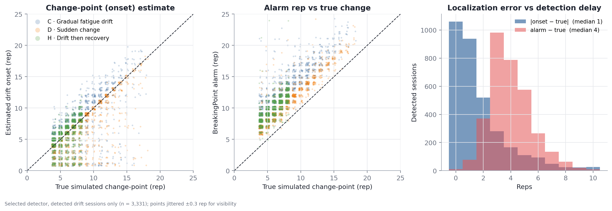
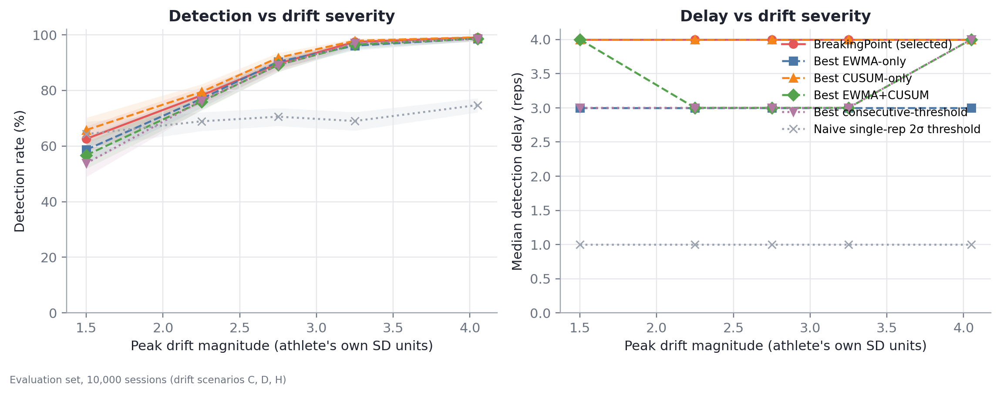
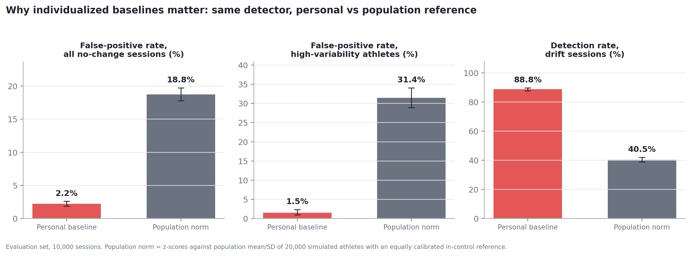
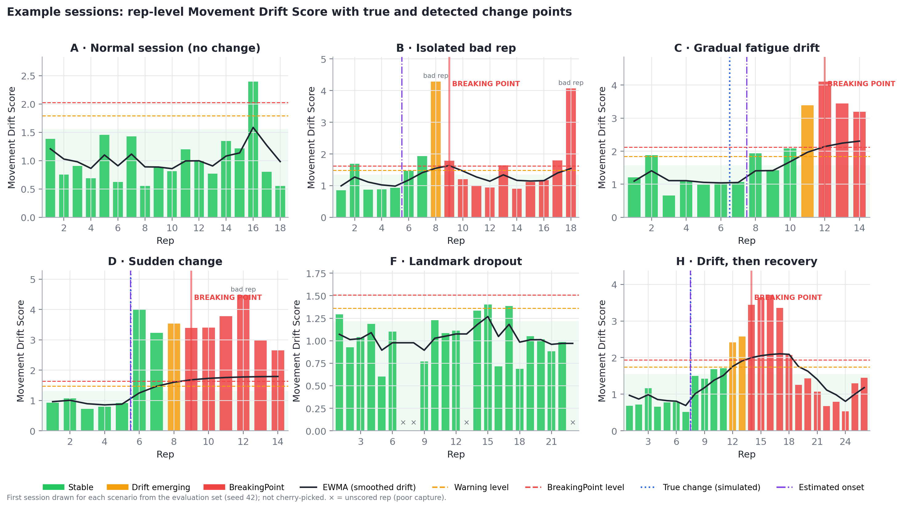
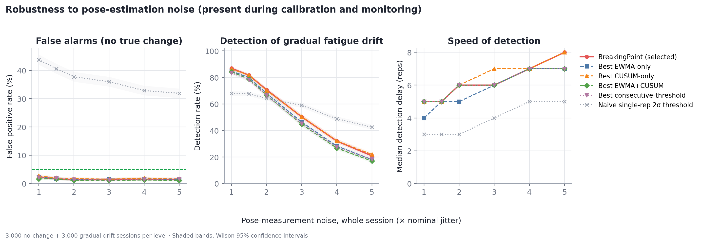
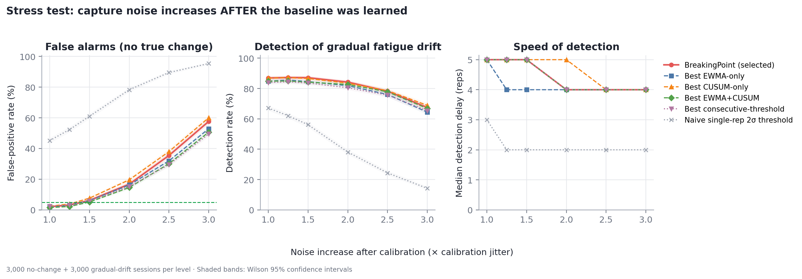
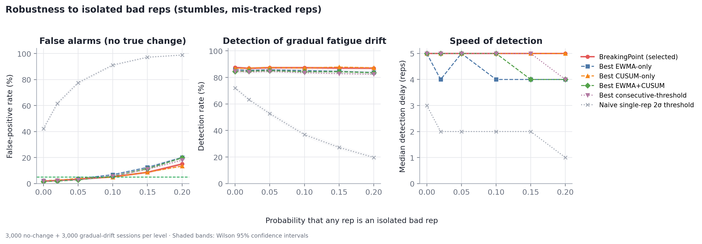
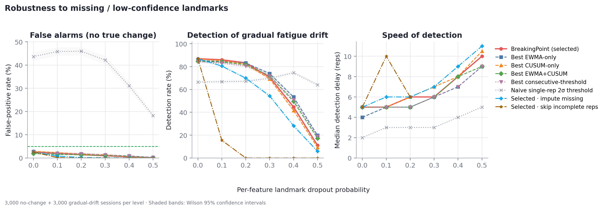
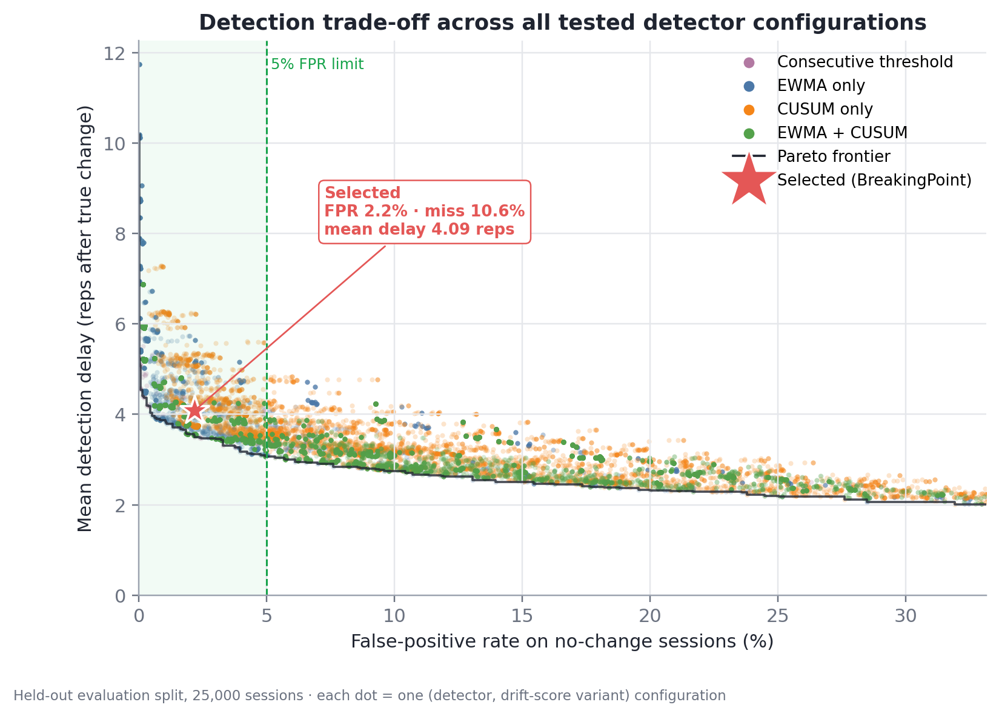
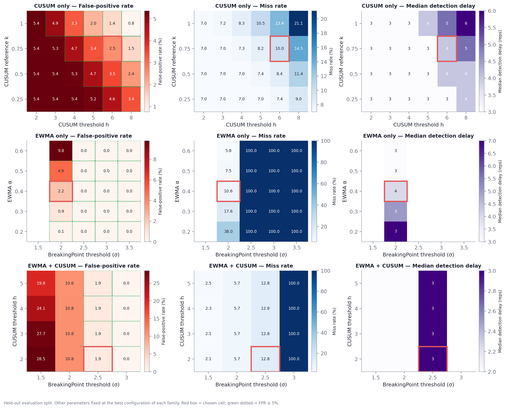
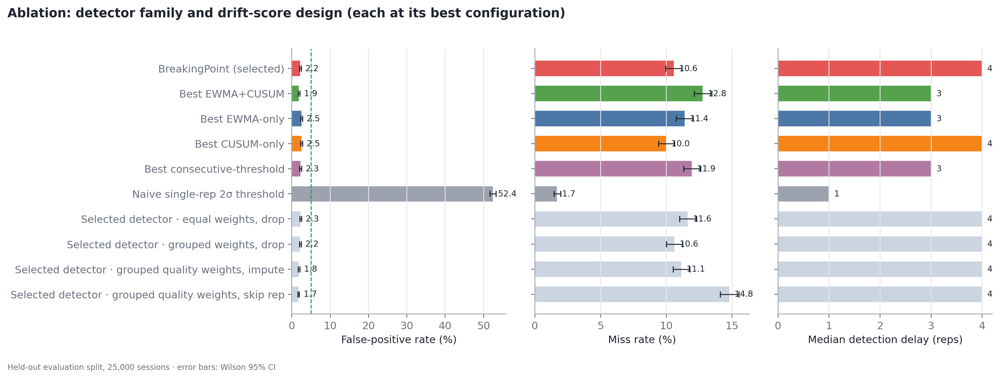

_Finalize stage took 22s._
